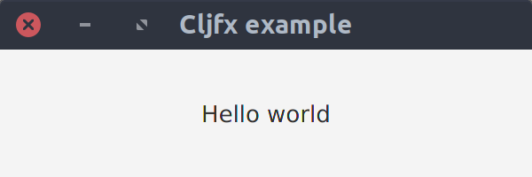
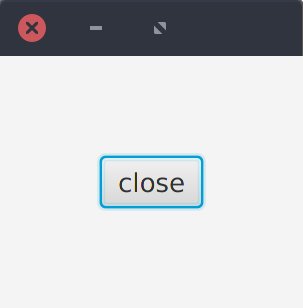
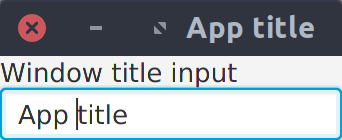
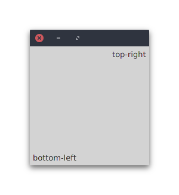

[](https://clojars.org/cljfx)
[](https://clojurians.slack.com/messages/cljfx/)

Cljfx is a declarative, functional and extensible wrapper of JavaFX
inspired by better parts of react and re-frame.

## Rationale

I wanted to have an elegant, declarative and composable UI
library for JVM and couldn't find one. Cljfx is inspired by react,
reagent, re-frame and fn-fx.

Like react, it allows to specify only desired layout, and handles
all actual changes underneath. Unlike react (and web in general) it does
not impose xml-like structure of everything possibly having multiple
children, thus it uses maps instead of hiccup for describing layout.

Like reagent, it allows to specify component descriptions using simple
constructs such as data and functions. Unlike reagent, it rejects using
multiple stateful reactive atoms for state and instead prefers composing
ui in more pure manner.

Like re-frame, it provides an approach to building large applications
using subscriptions and events to separate view from logic. Unlike
re-frame, it has no hard-coded global state, and subscriptions work on
referentially transparent values instead of ever-changing atoms.

Like fn-fx, it wraps underlying JavaFX library so developer can describe
everything with clojure data. Unlike fn-fx, it is more dynamic, allowing
users to use maps and functions instead of macros and deftypes, and has
more explicit and extensible lifecycle for components.

## Installation and requirements

Cljfx uses `tools.deps`, so you can add this repo with latest sha as a 
dependency:
```edn
 {cljfx {:git/url "https://github.com/cljfx/cljfx" :sha "<insert-sha-here>"}}
```
Cljfx is also published on clojars, so you can add `cljfx` as a maven
dependency, current version is on this badge: [](https://clojars.org/cljfx)

Minimum required version of clojure is 1.10, minimum JDK version is 11.

## Overview

### Hello world

Components in cljfx are described by maps with `:fx/type` key. By
default, fx-type can be:
- a keyword corresponding to some JavaFX class
- a function, which receives this map as argument and returns
  another description
- an implementation of Lifecycle protocol (more on that in [extending 
  cljfx](#extending-cljfx) section)

Minimal example:
```clj
(ns example
  (:require [cljfx.api :as fx]))

(fx/on-fx-thread
  (fx/create-component
    {:fx/type :stage
     :showing true
     :title "Cljfx example"
     :width 300
     :height 100
     :scene {:fx/type :scene
             :root {:fx/type :v-box
                    :alignment :center
                    :children [{:fx/type :label
                                :text "Hello world"}]}}}))
```
Evaluating this code will create and show a window:



The overall mental model of these descriptions is this:
- whenever you need a JavaFX class, use map where `:fx/type` key has a
  value of a kebab-cased keyword derived from that class name
- other keys in this map represent JavaFX properties of that class (also
  in kebab-case);
- if prop x can be changed by user, there is a corresponding
  `:on-x-changed` prop for observing these changes

### Renderer

To be truly useful, there should be some state and changes over time,
for this matter there is a renderer abstraction, which is a function 
that you may call whenever you want with new description, and cljfx will 
advance all the mutable state underneath to match this description. 
Example:
```clj
(def renderer
  (fx/create-renderer))

(defn root [{:keys [showing]}]
  {:fx/type :stage
   :showing showing
   :scene {:fx/type :scene
           :root {:fx/type :v-box
                  :padding 50
                  :children [{:fx/type :button
                              :text "close"
                              :on-action (fn [_]
                                           (renderer {:fx/type root
                                                      :showing false}))}]}}})

(renderer {:fx/type root
           :showing true})
```
Evaluating this code will show this:



Clicking `close` button will hide this window.

Renderer batches descriptions and re-renders views on fx thread only 
with last received description, so it is safe to call many times at 
once. Calls to renderer function return derefable that will contain 
component value with most recent description.

### Atoms

Example above works, but it's not very convenient: what we'd really like
is to have a single global state as a value in an atom, derive our
description of JavaFX state from this value, and change this atom's
contents instead. Here is how it's done:
```clj
;; Define application state

(def *state
  (atom {:title "App title"}))

;; Define render functions

(defn title-input [{:keys [title]}]
  {:fx/type :text-field
   :on-text-changed #(swap! *state assoc :title %)
   :text title})

(defn root [{:keys [title]}]
  {:fx/type :stage
   :showing true
   :title title
   :scene {:fx/type :scene
           :root {:fx/type :v-box
                  :children [{:fx/type :label
                              :text "Window title input"}
                             {:fx/type title-input
                              :title title}]}}})

;; Create renderer with middleware that maps incoming data - description -
;; to component description that can be used to render JavaFX state.
;; Here description is just passed as an argument to function component.

(def renderer
  (fx/create-renderer
    :middleware (fx/wrap-map-desc assoc :fx/type root)))

;; Convenient way to add watch to an atom + immediately render app

(fx/mount-renderer *state renderer)
```
Evaluating code above pops up this window:



Editing input then immediately updates displayed app title.

### Map events

Consider this example:

```clj
(defn todo-view [{:keys [text id done]}]
  {:fx/type :h-box
   :children [{:fx/type :check-box
               :selected done
               :on-selected-changed #(swap! *state assoc-in [:by-id id :done] %)
              {:fx/type :label
               :style {:-fx-text-fill (if done :grey :black)}
               :text text}]})
```

There are problems with using functions as event handlers:
1. Performing mutation from these handlers requires coupling with that
state, thus making `todo-view` dependent on mutable `*state`
2. Updating state from listeners complects logic with view, making
application messier over time
3. There are unnecessary reassignments to `on-selected-changed`:
functions have no equality semantics other than their identity, so on
every change to this view (for example, when changing it's text),
`on-selected-changed` will be replaced with another function with same
behavior.

To mitigate these problems, cljfx allows to define event handlers as
arbitrary maps, and provide a function to a renderer that performs 
actual handling of these map-events (with additional `:fx/event` key 
containing dispatched event):

```clj
;; Define view as just data

(defn todo-view [{:keys [text id done]}]
  {:fx/type :h-box
   :spacing 5
   :padding 5
   :children [{:fx/type :check-box
               :selected done
               :on-selected-changed {:event/type ::set-done :id id}}
              {:fx/type :label
               :style {:-fx-text-fill (if done :grey :black)}
               :text text}]})

;; Define single map-event-handler that does mutation

(defn map-event-handler [event]
  (case (:event/type event)
    ::set-done (swap! *state assoc-in [:by-id (:id event) :done] (:fx/event event))))

;; Provide map-event-handler to renderer as an option

(fx/mount-renderer
  *state
  (fx/create-renderer
    :middleware (fx/wrap-map-desc assoc :fx/type root)
    :opts {:fx.opt/map-event-handler map-event-handler}))

```

You can see full example at [examples/e09_todo_app.clj](examples/e09_todo_app.clj).

### Interactive development

Another useful aspect of renderer function that should be used during 
development is refresh functionality: you can call renderer function 
with zero args and it will recreate all the components with current 
description.

See walk-through in [examples/e12_interactive_development.clj](examples/e12_interactive_development.clj)
as an example of how to iterate on cljfx app in REPL.

### Special keys

Sometimes components accept specially treated keys. Main uses are:

1. Reordering of nodes (instead of re-creating them) in parents that may
   have many children. Descriptions that have `:fx/key` during
   advancing get reordered instead of recreated if their position in
   child list is changed. Consider this example:
   ```clj
   (let [component-1 (fx/create-component
                       {:fx/type :v-box
                        :children [{:fx/type :label
                                    :fx/key 1
                                    :text "- buy milk"}
                                   {:fx/type :label
                                    :fx/key 2
                                    :text "- buy socks"}]})
         [milk-1 socks-1] (vec (.getChildren (fx/instance component-1)))
         component-2 (fx/advance-component
                       component-1
                       {:fx/type :v-box
                        :children [{:fx/type :label
                                    :fx/key 2
                                    :text "- buy socks"}
                                   {:fx/type :label
                                    :fx/key 1
                                    :text "- buy milk"}]})
         [socks-2 milk-2] (vec (.getChildren (fx/instance component-2)))]
     (and (identical? milk-1 milk-2)
          (identical? socks-1 socks-2)))
   => true
   ```
   With `:fx/key`-s specified, advancing of this component reordered
   children of VBox, and didn't change text of any labels, because their
   descriptions stayed the same.
2. Providing extra props available in certain contexts. If node is
   placed inside a pane, pane can layout it differently by looking into
   properties map of a node. Nodes placed in ButtonBar can have
   OS-specific ordering depending on assigned ButtonData. These
   properties can be specified via keywords namespaced by container's
   fx-type. Example:
   ```clj
   (fx/on-fx-thread
     (fx/create-component
       {:fx/type :stage
        :showing true
        :scene {:fx/type :scene
                :root {:fx/type :stack-pane
                       :children [{:fx/type :rectangle
                                   :width 200
                                   :height 200
                                   :fill :lightgray}
                                  {:fx/type :label
                                   :stack-pane/alignment :bottom-left
                                   :stack-pane/margin 5
                                   :text "bottom-left"}
                                  {:fx/type :label
                                   :stack-pane/alignment :top-right
                                   :stack-pane/margin 5
                                   :text "top-right"}]}}}))
   ```
   Evaluating code above produces this window:

   

   For a more complete example of available pane keys, see
   [examples/e07_extra_props.clj](examples/e07_extra_props.clj)

### Factory props

There are some props in JavaFX that represent not a value, but a way to
construct a value from some input:
- `:page-factory` in pagination, you can use function receiving page
  index and returning any component description for this prop (see
  example in [examples/e06_pagination.clj](examples/e06_pagination.clj))
- various versions of `:cell-factory` in controls designed to display
  multiples of items (table views, list views etc.). You can use
  functions that receive items and return descriptions for these props,
  but they are a bit different: created cells have their own lifecycle
  for performance reasons, and that imposes a restriction that you can't
  specify `:fx/type` in returned cell descriptions. There are various
  usage examples available in
  [examples/e16_cell_factories.clj](examples/e16_cell_factories.clj)

### Subscriptions and contexts

Once application becomes complex enough, you can find yourself passing
very big chunks of state everywhere. Consider this example: you develop
a task tracker for an organization. A typical task view on a dashboard
displays a description of that task and an assignee. Required state for
this view is plain and simple, just a simple data like that:
```clj
{:title "Fix NPE on logout during full moon"
 :state :todo
 :assignee {:id 42 :name "Fred"}}
```
Then one day comes a requirement: users of this task tracker should be
able to change assignee from the dashboard. Now, we need a combo-box
with all assignable users to render such a view, and required data becomes
this:
```clj
{:title "Fix NPE on logout during full moon"
 :state :todo
 :assignee {:id 42 :name "Fred"}
 :users [{:id 42 :name "Fred"}
         {:id 43 :name "Alice"}
         {:id 44 :name "Rick"}]}
```
And you need to compute it once in one place and then pass it along
multiple layers of ui to this view. This is undesirable:
- it will lead to unnecessary re-renderings of views that just pass data
  further when it changes
- it complects reasoning about what actually a view needs: is it just a
  task? or a task with some precomputed attributes?

To mitigate this problem, cljfx introduces optional abstraction called
**context**, which is inspired by re-frame's subscriptions. Context is a
black-box wrapper around application state map, with an api
function `fx/sub` to look inside wrapped state. `fx/sub` usage has 2
flavors:
1. Keys: anything except function, will return corresponding value from
   wrapped map.
2. Subscription functions: any function that receives context as first
   argument. `fx/sub`-scribing to such functions will lead to a call to
   this function, and it in turn may subscribe to other keys and
   subscription functions.

Returned values from subscription functions are memoized in this context
(so it actually is a *memoization* context), and subsequent `sub` calls
will result in cache lookup. The best thing about context is that not
only does it support updating wrapped values via `swap-context` and
`reset-context`, it also reuses this memoization cache to minimize
re-calculation of subscription functions in successors of this context.
This is done via tracking of `fx/sub` calls inside subscription
functions, and checking if their dependencies changed. Example:
```clj
(def context-1
  (fx/create-context
    {:tasks [{:text "Buy milk" :done false}
             {:text "Buy socks" :done true}]}))

;; Simple subscription function that depends on :tasks key of wrapped map. Whenever value
;; of :tasks key "changes" (meaning whenever there will be created new context with
;; different value on :tasks key), subscribing to this function will lead to a call to
;; this function instead of cache lookup
(defn task-count [context]
  (count (fx/sub context :tasks)))

;; Using subscription functions:
(fx/sub context-1 task-count) ; => 2

;; Another subscription function depending on :tasks key of wrapped map
(defn remaining-task-count [context]
  (count (remove :done (fx/sub context :tasks))))

(fx/sub context-1 remaining-task-count) ; => 1

;; Indirect subscription function: it depends on 2 previously defined subscription
;; functions, which means that whenever value returned by `task-count` or
;; `remaining-task-count` changes, subscribing to this function will lead to a call
;; instead of cache lookup
(defn task-summary [context]
  (prn :task-summary)
  (format "Tasks: %d/%d"
          (fx/sub context remaining-task-count)
          (fx/sub context task-count)))

(fx/sub context-1 task-summary) ; (prints :task-summary) => "Tasks: 1/2"

;; Creating derived context that reuses cache from `context-1`
(def context-2
  (fx/swap-context context-1 assoc-in [:tasks 0 :text] "Buy bread"))

;; Validating that cache entry is reused. Even though we updated :tasks key, there is no
;; reason to call `task-summary` again, because it's dependencies, even though
;; recalculated, return the same values
(fx/sub context-2 task-summary) ; (does not print anything) => "Tasks: 1/2"
```

This tracking imposes a restriction on subscription functions: they
should not call `fx/sub` after they return (which is possible if they
return lazy sequence which may call `fx/sub` during element
calculation).

Using context in cljfx application requires 2 things:
- passing context to all lifecycles in description graph, which is done
  by using `fx/wrap-context-desc` middleware
- using special lifecycle (`fx/fn->lifecycle-with-context`) for function
  fx-types that uses this context

Minimal app example using contexts:
```clj
;; Define application state as context

(def *state
  (atom (fx/create-context {:title "Hello world"})))

;; Every description function receives context at `:fx/context` key

(defn root [{:keys [fx/context]}]
  {:fx/type :stage
   :showing true
   :scene {:fx/type :scene
           :root {:fx/type :h-box
                  :children [{:fx/type :label
                              :text (fx/sub context :title)}]}}})

(def renderer
  (fx/create-renderer
    :middleware (comp
                  ;; Pass context to every lifecycle as part of option map
                  fx/wrap-context-desc
                  (fx/wrap-map-desc (fn [_] {:fx/type root})))
    :opts {:fx.opt/type->lifecycle #(or (fx/keyword->lifecycle %)
                                        ;; For functions in `:fx/type` values, pass
                                        ;; context from option map to these functions
                                        (fx/fn->lifecycle-with-context %))}))

(fx/mount-renderer *state renderer)
```

Using contexts effectively makes every fx-type function a subscription
function, so no-lazy-fx-subs-in-returns restriction applies to them too.
On a plus side, it makes re-rendering very efficient: fx-type components
get re-rendered only when their subscription values change.

For a bigger example see
[examples/e15_task_tracker.clj](examples/e15_task_tracker.clj).

Another point of concern for context is cache. By default it will grow
forever, which at certain point might become problematic, and we may
want to trade some cpu cycles for recalculations to decrease memory
consumption. There is a perfect library for it:
[core.cache](https://github.com/clojure/core.cache). `fx/create-context`
supports cache factory (a function taking initial cache map and
returning cache) as a second argument. What kind of cache
to use is a question with no easy answer, you probably should try
different caches and see what is a better fit for your app.

### Event handling on steroids

While using maps to describe events is a good step towards mostly pure
applications, there is still a room for improvement:
- many event handlers dereference app state, which makes them coupled 
  with an atom: mutable place
- almost every event handler still mutates app state, which also makes 
  them coupled
- events are handled on JavaFX application thread, which may lead to 
  responsiveness issues

Cljfx borrows solutions to all these problems from re-frame, providing
map event handler wrappers that allow having co-effects (pure inputs), 
effects (pure outputs), and async handling. Lets walk through this 
example event handler and see how we can make it pure:

```clj
(def *state
  (atom {:todos []}))

(defn handle [event]
  (let [state @*state
        {:keys [event/type text]} event]
    (case type
      ::add-todo (reset! *state (update state :todos conj {:text text :done false})))))

;; usage:
(handle {:event/type ::add-todo :text "Buy milk"})
```

1. Co-effects: `wrap-co-effects`

   It would be nice to not have to deref state atom and instead receive 
   it as an argument, and that is what co-effects are for. Co-effect is 
   a term taken from re-frame, and it means current state as data, as 
   presented to event handler. In cljfx you describe co-effects as a map
   from arbitrary key to function that produces some data that is then 
   passed to handler:
   ```clj
   (defn handle [event]
     ;; receive state as part of an event
     (let [{:keys [event/type text state]} event]
       (case type
         ::add-todo (reset! *state (update state :todos conj {:text text :done false})))))
         
   (def actual-handler 
     (-> handle
         (fx/wrap-co-effects {:state #(deref *state)})))
   
   ;; usage:
   (actual-handler {:event/type ::add-todo :text "Buy milk"})
   ```
2. Effects: `wrap-effects`

   Instead of performing side-effecting operations from handlers, we can
   return data that describes how to perform these side-effecting 
   operations. `fx/wrap-effects` uses that data to perform side effects.
   You describe effects as a map from arbitrary keys to side-effecting
   function. Wrapped handler in turn should return a seqable of 
   2-element vectors. First element is a key used to find side-effecting
   function, and second is an argument to it:
   ```clj
   (defn handle [event]
     (let [{:keys [event/type text state]} event]
       (case type
         ;; Now handlers not only receive just data, they also return just data
         ;; Returning map is a convenience option that can be used as a return
         ;; value, and sequences like [[:state ...] [:state ...]] are fine too 
         ::add-todo {:state (update state :todos conj {:text text :done false})})))
   
   (def actual-handler
     (-> handle
         (fx/wrap-co-effects {:state #(deref *state)})
         (fx/wrap-effects {:state (fn [state _] (reset! *state state))})))
   ```
   In addition to value provided by wrapped handler, side-effecting 
   function receives a function they can call to dispatch new events. 
   While it's useless for resetting state, it can be useful in
   other circumstances. One is you can create a `:dispatch` effect that
   dispatches another events, and another is you can describe 
   asynchronous operations such as http requests as just data. Examples
   of both can be found at [examples/e18_pure_event_handling.clj](examples/e18_pure_event_handling.clj).
   This approach allows to specify side effects in a few places, and 
   then have easily testable handlers:
   ```clj
   (handle {:event/type ::add-todo
            :text "Buy milk"
            :state {:todos []}})
   => {:state {:todos [{:text "Buy milk", :done false}]}}
   ;; data in, data out, no mocks necessary! 
   ```
3. Async handling: `wrap-async`

   Finally, you can wrap your handler with `fx/wrap-async` to offload 
   event handling to background thread:
   ```clj
   (def actual-handler
     (-> handle
         (fx/wrap-co-effects {:state #(deref *state)})
         (fx/wrap-effects {:state (fn [state _] (reset! *state state))})
         (fx/wrap-async)))
   ```
   Note that it uses agents underneath, so you will need to call 
   `clojure.core/shutdown-agents` on exit. Another thing to keep in mind
   is that there are couple of cases where you want event handling to 
   be synchronous: 
   - when syncing typed text in input fields with app state by using 
     `:text` and `:on-text-changed` props to avoid text reverts when 
     typing too fast;
   - when dispatching events on startup that prepare some views to avoid
     showing empty screens.
   
   In these cases you can put `:fx/sync true` to event map: that will 
   block call to event handler until this event is processed.

### How does it actually work

There are 3 main building blocks of cljfx: components, lifecycles and
mutators. Each are represented by protocols, here they are:
```clj
(defprotocol Component
  :extend-via-metadata true
  (instance [this]))

(defprotocol Lifecycle
  :extend-via-metadata true
  (create [this desc opts])
  (advance [this component desc opts])
  (delete [this component opts]))

(defprotocol Mutator
  :extend-via-metadata true
  (assign! [this instance coerce value])
  (replace! [this instance coerce old-value new-value])
  (retract! [this instance coerce value]))
```
Component is an immutable value representing some object in some state
(that object may be mutable — usually it's a javafx object), that also
has a reference to said object instance.

Lifecycle is well, a lifecycle of a component. Component gets created 
from a description once, advanced to new description zero or more times, 
and then deleted. Cljfx is a composition of multiple different 
lifecycles, each useful in their own place. `opts` is a map that 
contains some data used by different lifecycles. 2 opt keys that are 
used by default in cljfx are:
- `:fx.opt/type->lifecycle` — used in `dynamic` lifecycle to select what
  lifecycle will be actually used for description based by value in
  `:fx/type` key.
- `:fx.opt/map-event-handler` — used in `event-handler` lifecycle that
  checks if event handler is a map, and if it is, call function provided
  by this key when event happens. It should be noted, that such event
  handlers receive additional key in a map (`:fx/event`) that contains
  event object, which may be context dependent: for JavaFX change
  listeners it's a new value, for JavaFX event handlers it's an event,
  for runnables it's `nil`, etc.

Another notable lifecycle is `cljfx.composite/lifecycle`: it
manages mutable JavaFX objects: creates instance in `create`, advances
any changes to props (each individual prop may be seen as lifecycle +
mutator), and has some useful macros to simplify generating composite
lifecycles for concrete classes.

Finally, mutator is a part of prop in composite lifecycles that
performs actual mutation on instance when values change. It also
receives `coerce` function which is called on value before applying it.
Most common mutator is `setter`, but there are some other, for example,
`property-change-listener`, which uses `addListener` and
`removeListener`.

### Extending cljfx

Cljfx might have some missing parts that you'll want to fill. Not 
everything can be configured with lifecycle opts and renderer 
middleware, and in that case you are encouraged to create and use 
extension lifecycles. Fx-types in descriptions can be implementations of 
Lifecycle protocol, and with this escape hatch you get a lot more 
freedom. Since these lifecycles can introduce different meanings for 
what descriptions mean in their context, they should stand out from 
other keyword or function lifecycles, and convention is to have `ext-` 
prefix in their names. 
 
#### Included extension lifecycles

1. `fx/ext-instance-factory`

   Using this extension lifecycle you can simply create a component 
   using 0-argument factory function:
   ```clj
   (fx/instance
     (fx/create-component
       {:fx/type fx/ext-instance-factory
        :create #(Duration/valueOf "10ms")}))
   => #object[javafx.util.Duration 0x2f5eb358 "10.0 ms"]
   ```
   
2. `fx/ext-on-instance-lifecycle`

   You can use this lifecycle to additionally setup/tear down instance
   of otherwise declaratively created value:
   ```clj
   (fx/instance
     (fx/create-component
       {:fx/type fx/ext-on-instance-lifecycle
        :on-created #(prn "created" %)
        :desc {:fx/type fx/ext-instance-factory
               :create #(Duration/valueOf "10ms")}}))
   ;; prints "created" #object[javafx.util.Duration 0x284cdce9 "10.0 ms"]
   => #object[javafx.util.Duration 0x284cdce9 "10.0 ms"]
   ```
   
3. `fx/ext-let-refs` and `fx/ext-get-ref`

   You can create managed components outside of component tree using 
   `fx/ext-let-refs`, and then use instances of them, possibly in 
   multiple places, using `fx/ext-get-ref`:
   ```clj
   {:fx/type fx/ext-let-refs
    :refs {::button-a {:fx/type :button
                       :text "Press Alt+A to focus on me"}}
    :desc {:fx/type :v-box
           :children [{:fx/type :label
                       :text "Mnemonic _A"
                       :mnemonic-parsing true
                       :label-for {:fx/type fx/ext-get-ref
                                   :ref ::button-a}}
                      {:fx/type fx/ext-get-ref
                       :ref ::button-a}]}}
   ```
   One use case is for using references in props that expect nodes in a 
   scene graph (such as label's `:label-for`), and another is having 
   dialogs defined close to usage places, you can find an example of 
   such dialog at [examples/e22_button_with_confirmation_dialog.clj](examples/e22_button_with_confirmation_dialog.clj) 

4. `fx/ext-many`

   Usually props that expect collections of elements already ask for a
   collection of descriptions, but there might be cases where you want to manage
   a coll even though you are asked for a single element. In this case you can
   use `fx/ext-many` to describe multiple of components, for example, to show
   multiple windows at once:
   ```clj
   (fx/on-fx-thread
     (fx/create-component
       {:fx/type fx/ext-many
        :desc [{:fx/type :stage
                :showing true}
               {:fx/type :stage
                :showing true}]}))
   ```
   See [examples/e10_multiple_windows.clj](examples/e10_multiple_windows.clj)
   and [examples/e17_dialogs.clj](examples/e17_dialogs.clj)

5. `fx/make-ext-with-props`

   Using this function you can create extension lifecycles that handle whatever
   additional props you need. These props will be applied after props of
   original lifecycle. There are some predefined lifecycles providing extra
   props for controlling default selection models in TabPane, ListView,
   TableView, TreeView and TreeTableView, see [examples/e27_selection_models.clj](examples/e27_selection_models.clj).

Examples of included extension lifecycles are available at
[examples/e21_extension_lifecycles.clj](examples/e21_extension_lifecycles.clj).

#### Writing extension lifecycles

If that's not enough, you can write your own, but this requires more 
thorough knowledge of cljfx: take a look at 
[cljfx.lifecycle](src/cljfx/lifecycle.clj) namespace to see how other 
lifecycles are implemented.

#### Wrapping other java-based JavaFX components

There is `cljfx.composite/props` macro to create a prop-map for 
arbitrary Java class. Also there is a `cljfx.composite/describe` macro
that allows to construct a lifecycle from a class and a prop map, and 
plenty of examples in `cljfx.fx.*` namespaces that can help you make
custom java components for JavaFX cljfx-friendly.

### Combining it all together

Now that every piece is laid out, it's time to combine them into 
application. What suits your needs is up to you, but if you plan to 
build something non-trivial, you'll probably want to combine all of the
pieces, and easiest way to start is using `create-app` function. It 
accepts app atom, event handler and function producing view description
and wires them all together:
```clj
(def app
  (fx/create-app *context
    :event-handler handle-event
    :desc-fn (fn [_]
               {:fx/type root-view})))
```
Using that as a starting point, you can build your application using 
pure functions for everything: views, subscriptions, events. 
`create-app` also allows some optional settings, such as `:effects`,
`:co-effects` and `:async-agent-options` for configuring event handling 
and `:renderer-middleware` for configuring renderer. An example of such
application can be found at 
[examples/e20_markdown_editor.clj](examples/e20_markdown_editor.clj).

### Gotchas

#### `:fx/key` should be put on descriptions in a list, not inside these descriptions

For example:
```clj
;; Don't do it, this won't work:

(defn item-view [{:keys [item]}]
  {:fx/type :label
   ;; Do not specify `:fx/key` here!
   :fx/key (:id item)
   :text (:title item)})

(defn item-list-view [items]
  {:fx/type :v-box
   :children (for [i items]
               {:fx/type item-view
                :item i})})
```
Lifecycle that manages lists of things (`dynamics`) can't see how it's
elements will unfold, so it needs to have `:fx/key`-s where it can see
them — in the element descriptions that it gets:
```clj
;; Do this to specify `:fx/key`-s:

(defn item-view [{:keys [item]}]
  {:fx/type :label
   :text (:title item)})

(defn item-list-view [items]
  {:fx/type :v-box
   :children (for [i items]
               {:fx/type item-view
                ;; Put `:fx/key` to description that is a part of a list
                :fx/key (:id i)
                :item i})})
```
#### Only mutable objects are described with `:fx/type`

Lifecycles describe how things change, and some things in JavaFX don't
change. For example, `Insets` class represents an immutable value, so
when describing padding you don't need a map with `:fx/type` key:
```clj
{:fx/type :region
 :padding {:top 10 :bottom 10 :left 10 :right 10}}
```
It doesn't have to be a map at all:
```clj
{:fx/type :region
 :padding 10}
```
How does it work? Instead of using lifecycle there is a coercion
mechanism that transforms values before assigning them to a model, most
of them are in `cljfx.coerce` namespace.

#### Coercion

Some notable coercion examples and approaches:
- all enums and enum-like things can be expressed as kebab-cased
  keywords, for example `:red` for colors, `:crosshair` for cursors
- you still can use actual instances of target classes, for example
  `Cursor/CROSSHAIR` for cursors
- for classes with 1-arg constructors you can supply just that, for
  example url string for images
- for classes with multi-arg constructors you can supply args as a map,
  for example map with `:url` and `:background-loading` for images
- styles can be specified as maps, for example
  `{:-fx-background-color :lightgray}`
- durations can be specified as vector like `[10 :ms]` or `[2 :h]`
- key combinations can be vectors. There are 2 flavors of key
  combinations in JavaFX: KeyCodeCombination, created if last element of
  that vector is keyword, for example, `[:ctrl :period]`, and
  KeyCharacterCombination, created if last element of that vector is
  string, for example `[:ctrl "."]`

#### Differences with JavaFX

There are some "synthetic" properties that provide needed functionality
usually used through some other API:
- Canvas has a `:draw` prop that is a function that receives Canvas as
  an argument and should use it to draw on it ([example](examples/e28_canvas.clj))
- MediaPlayer has `:state` prop that can be either `:playing`,
  `:paused` or `:stopped`, and will call `play`/`pause`/`stop` methods
  on media player when this prop is changed
- `:url` prop of WebView will call `load` method on this view's web
  engine

#### No local mutable state

One thing that is easy to do in react/reagent, but actually complects
things, is local mutable state: every component can have it's own
mutable state that lives independently from overall app state. This
makes reasoning about state of the app harder: you need to take lots of
small pieces into account. Another problem is this state is unreliable,
because it is only here when a component is here. And if it gets
recreated, for example, after closing some panel it resides in and
reopening it back, this state will be lost. Sometimes we want this
behavior, sometimes we don't, and it's possible to choose whether this
state will be retained or not only if it's a part of a global app state.

#### No controlled props

In react, setting `value` prop on text input makes it controlled,
meaning it can't be changed unless there is also a change listener
updating this value on typing. This is much harder to do in JavaFX, so
there is no such thing. But you still can keep typed text in sync with
internal state by having both `:text` and `:on-text-changed` props (see
example in [examples/e09_todo_app.clj](examples/e09_todo_app.clj))

## More examples

There are various examples available in [examples](examples) folder.
To try them out:
1. Clone this repo and cd into it:
   ```shell
   git clone https://github.com/cljfx/cljfx.git
   cd cljfx 
   ```
2. Launch repl with `:examples` alias and require examples:
   ```shell
   clj -A:examples
   # Clojure 1.10
   # user=> (require 'e15-task-tracker)
   # nil ;; window appears
   ```

## API stability, public and internal code

Newer versions of cljfx should never introduce breaking changes, so if 
an update broke something, please file a bug report. Growth of cljfx 
should happen only by accretion (providing more), relaxation (requiring 
less) and fixation (bashing bugs).

This applies to public API of cljfx. `cljfx.api` namespace and all 
behaviors that can be observed by using it are a public API. Other 
namespaces have a docstring stating what is and is not a public API.

Current shapes of values implementing `Lifecycle`, `Component` and 
`Mutator` protocols are internal and subject to change: treat them as 
a protocol implementations only. Context is not a protocol, but it's 
shape is internal too. 

Keywords with `fx` namespace in component descriptions are reserved: new
ones may be introduced.

## Food for thought

Internal list of ideas to explore:

- missing observable maps: Scene's getMnemonics
- `:row-factory` in tree-view/tree-table-view should be similar to cell 
  factories
- make exceptions more informative
- are controlled props possible? (controls, also stage's `:showing`)
- wrap-factory may use some memoizing and advancing
- add tests for various lifecycles and re-calculations
- update to same desc should be identical (component-vec)
- expand on props and composite lifecycle. What's known about them:
  - ctor:
    - scene requires root, root can be replaced afterwards
    - xy-chart requires axis, they can't be replaced afterwards
  - prop in composite lifecycle may be a map or a function taking
    instance and returning prop!
  - changing media should re-create media player
- big app with everything in it to check if/how it works (generative
  tests maybe?)
- if animation is to be implemented, it probably should be done as in
  https://popmotion.io/
- declarative timers? problem is to figure out start/loop semantics. 
  Examples:
  - caret in custom text input may have timer that restarts on typing
  - flipbook animation player needs to restart timer on FPS settings 
    change 
