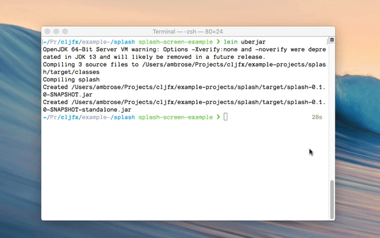

# Example splash screen for a cljfx UI

> Contributed by Ambrose Bonnaire-Sergeant



Starting cljfx takes a little while--even with AOT-compiled sources.
This example shows how to make a splash screen that loads
very quickly via JavaFX [preloaders](https://docs.oracle.com/javafx/2/deployment/preloaders.htm).

Once cljfx is ready, the splash screen will be replaced by the cljfx UI.

## Usage

Run with splash screen:

```shell
lein run
```

Run via uberjar:

```shell
lein uberjar
java -jar target/splash-0.1.0-SNAPSHOT-standalone.jar
```

Run without splash screen (interactive workflow):

```clojure
lein repl
...
splash=> (-main)
#object[clojure.lang.Delay 0x74132450 {:status :pending, :val nil}]
```
